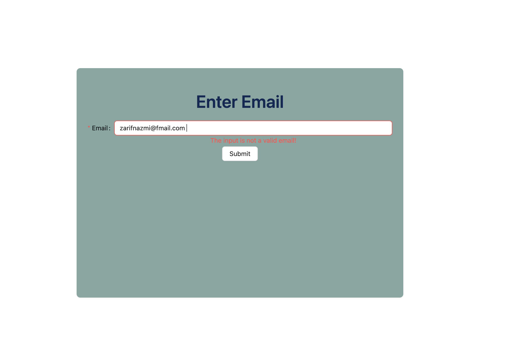
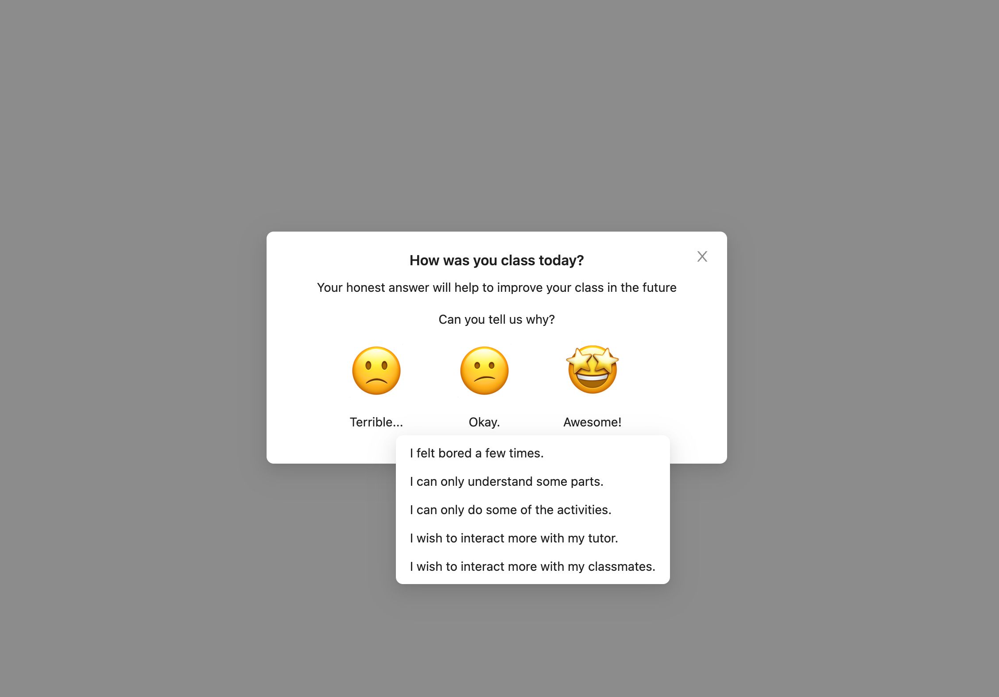

# Edu Frontend

A simple React.js + TypeScript app to submit feedback.
This project was bootstrapped with [Create React App](https://github.com/facebook/create-react-app).

## Components

 - React.js
 - TypeScript
 - Redux Observable Epics
 - Ant Design

 ## Screenshots

  

## Run the app

1. Install all the dependencies

```
$ yarn install
```

2. Add the `.env` file to the project. Follow the `.env.template` format.

```
REACT_APP_SUGGESTIONS_API=http://localhost:8000/review/suggestions
REACT_APP_FEEDBACK_API=http://localhost:8000/review/feedbacks
```

3. Runs the app in the development mode.\
Open [http://localhost:3000](http://localhost:3000) to view it in the browser.

The page will reload if you make edits.\
You will also see any lint errors in the console.

```
$ yarn start
```